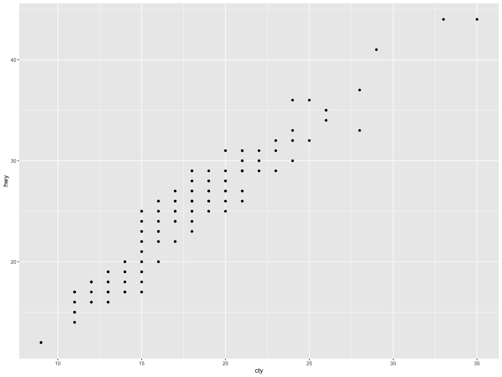
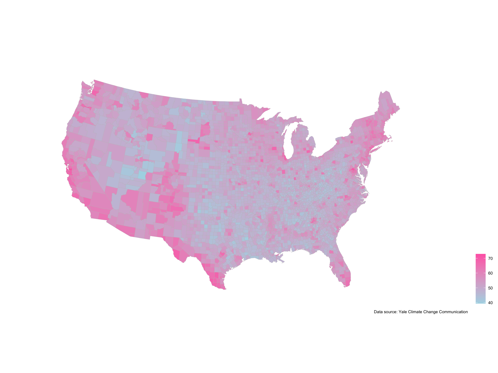

This is an example of the team project web-page.

&nbsp;

## US county map of climate change belief in 2018

&nbsp;
__Estimated percentage who think that global warming is caused mostly by human activities__


```r
library(tidyverse)
library(ggthemes)

cc_belief_county <- read.table(
  'https://bcecon.github.io/cc_belief_county.csv',
  sep = ',',
  header = TRUE,
  stringsAsFactor = TRUE
)

# Example
ggplot(mpg) + geom_point(aes(x = cty, y = hwy))
```



```r
# US county map of climate change opinion
legend_title <- ""
ggplot(data = cc_belief_county) +
  geom_polygon(aes(long, lat, group = group, 
                   fill = human2018),
               color = "grey", size = 0.1) +
  coord_map("bonne", parameters = 41.6) + 
  scale_fill_gradient(legend_title, low='lightblue', high='hotpink') +
  theme_map() + theme(legend.position="right") +
  labs(caption = "Data source: Yale Climate Change Communication")
```




