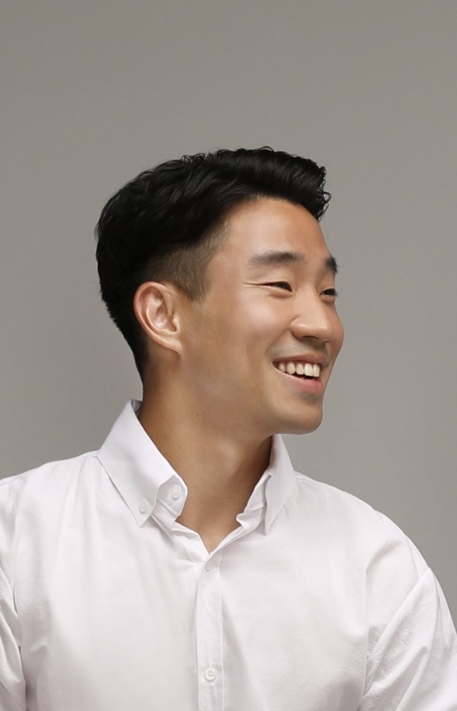

```{r setup, include=FALSE}
knitr::opts_chunk$set(echo = FALSE, message = FALSE, warning = FALSE)
library(tidyverse)
library(knitr)
library(here)
library(lubridate)
library(kableExtra)
library(DT)
library(glue)
library(readxl)
library(stringi)

# install.packages("remotes")
# remotes::install_github("mitchelloharawild/icons")
# install.packages("fontawesome")
library(fontawesome)


#### publications #####
publications <- read_csv("_content/publications.csv")

#### all other entries #####
cv_entries <- read_csv("_content/cv_entries.csv") %>%
  dplyr::mutate(year_begin = year(mdy(date))) %>%
  dplyr::mutate(year_end = case_when(
    date_end == "present" ~ date_end,
    !is.na(date_end) ~ str_sub(year(mdy(date_end)), 1, 4),
    is.na(date_end) ~ date_end
  )) %>%
  dplyr::mutate(year = ifelse((is.na(year_end) | year_begin == year_end),
                      year_begin,
                      str_c(year_begin, " --- ", year_end)))


blank_year_when_repeated <- function(cv_entry_tibble){
  cv_entry_tibble %>% 
    dplyr::mutate(row_number = row_number()) %>% 
    dplyr::mutate(year_begin = as.character(year_begin),
           year_begin = case_when(
             row_number == 1 ~ year_begin,
             year_begin == lag(year_begin) ~ str_c('<span class="repeated-year">', year_begin, '</span>'),
             year_begin != lag(year_begin) ~ year_begin
           )) %>% 
    dplyr::mutate(year = ifelse(!is.na(lag(year)) & lag(year) == year, 
                          str_c('<span class="repeated-year">', year, '</span>'),
                          year))
}
```


# Summary


[**Last Updated Time**: `r Sys.time()`]{style="float:right"}  

***

<br>  


:::::: {.cols data-latex=""}

::: {.column width="66%" data-latex="{0.66\textwidth}"}


Coding in **Python, R, and SQL** is my passion and has enabled me to [automate numerous redundant daily tasks](https://github.com/aLin-96/notion_automation), perform statistical analyses for various projects, and even create [personal websites](https://alin-96.github.io/). 

As a graduating Senior at SUNY Geneseo with a **Mathematics major** and Data Analytics concentration, I have honed strong skills in **data analysis, data visualization, and machine learning**. 

I am eager to apply my programming and analytical skills to a growing company and am actively seeking a challenging role as a Data Analyst or Data Scientist. 

Previously, I worked as a Data Manager at a hospitality company in Korea, where I have helped increase the weekly revenue by over 3000% by analyzing the market and creating python algorithms. 

:::

::: {.column width="5%" data-latex="{.05\textwidth}"}
\ 
<!-- an empty Div (with a white space), serving as
a column separator -->
:::

::: {.column width="22%" data-latex="{0.22\textwidth}"}

:::

::::::
  
::: {.column width="90%" data-latex="{0.90\textwidth}"}

Currently, I am a part-time Data Analytics Tutor at SUNY Geneseo teaching students the fundamentals of Data Analytics and introducing machine learning basics.

My **Core Technical Skills** include:

  - SQL, Python, R, Tableau  
  - Machine Learning  
  - Data Wrangling/ Manipulation
  - Data Modeling  
  - Data Visualization  

My goal is to join a company that provides various learning experiences and personal growth. A curious company that constantly challenges itself to find a better and faster solution would be ideal. 

Don't hesitate to get in touch with me via email or connect with me on LinkedIn to find out how I can add value to your team.

:::

<br>  


:::::::::::::::::: {.cols data-latex=""}

<font size="3">

::: {.column width="10%" data-latex="{0.10\textwidth}"}
**Websites**:
:::

::: {.column width="3%" data-latex="{0.03\textwidth}"}
\  

:::

::: {.column width="11%" data-latex="{0.11\textwidth}"}
 [Portfolio](https://www.andyleeproject.com/)
:::

::: {.column width="11%" data-latex="{0.11\textwidth}"}
 [Projects](https://alin-96.github.io/)
:::

::: {.column width="11%" data-latex="{0.11\textwidth}"}

 [Github](https://github.com/aLin-96)  
:::

::: {.column width="11%" data-latex="{0.11\textwidth}"}
 
 [LinkedIn](https://www.linkedin.com/in/jaehyungandylee/)  
:::

::: {.column width="11%" data-latex="{0.11\textwidth}"}
 
 [Resume `r fa("fas fa-file-pdf", fill = "red")`](Jaehyung Lee Resume.pdf)
:::

</font>

::::::::::::::::::

Contact Information: anddy0622@gmail.com


<br>  

<br>

# Current Position
```{r}
cv_entries %>% 
  filter(type == 'current_positions', is.na(exclude)) %>%
  mutate(what = str_c("<span class='cv-entry-title'>", what, "</span><br>", 
                      where)) %>% 
  select(year, what) %>% 
  kbl(padding = 0, col.names = NULL, escape = FALSE) %>%
  kable_styling( bootstrap_options = c("hover", "condensed"))  %>% 
  column_spec(1, width = "15%")

```

<br>

# Education
```{r}
cv_entries %>% 
  filter(type == 'education') %>% 
  mutate(what = str_c( "<span class='cv-entry-title'>", 
                              what, "</span>, ", where,
                              "<br>", 
                       ifelse(is.na(additional_info), "", additional_info) 
                       , "<br>", 
                       ifelse(is.na(additional_info2), "", additional_info2))) %>% 
  select(year, what) %>% 
  kbl(padding = 0, col.names = NULL, escape = FALSE) %>%
  kable_styling( bootstrap_options = c("hover", "condensed"))   %>% 
  column_spec(1, width = "15%")

```


<br>


# Work Experience
```{r}
cv_entries %>% 
  filter(type == 'work', is.na(website)) %>% 
  mutate(additional_info = replace_na(additional_info, "")) %>% 
  mutate(what = str_c("<span class='cv-entry-title'>", what, "</span><br class='work-break'>", where, "<br>", additional_info)) %>% 
  arrange(desc(date)) %>% 
  select(year, what) %>% 
  kbl(padding = 0, col.names = NULL, escape = FALSE) %>%
  kable_styling( bootstrap_options = c("hover", "condensed"))   %>% 
  column_spec(1, width = "15%")
```

<br>


# Skills
```{r}
cv_entries %>% 
  filter(type == 'technical') %>% 
  mutate(icon = case_when(
    str_detect(what, "Programming") ~ "fa-bar-chart",
    str_detect(what, "Speaking") ~ "fa-flask",
    str_detect(what, "Soft") ~ "fa-laptop"
  )) %>% 
  mutate(what = str_c("<i class='fa fa-lg ", icon, "'></i> &nbsp;<span class='cv-entry-title'>", what, "</span> ", additional_info)) %>% 
  select(type, what) %>% 
  mutate(type = "") %>% 
  kbl(padding = 0, col.names = NULL, escape=FALSE) %>%
  kable_styling( bootstrap_options = c("hover", "condensed")) 
```
